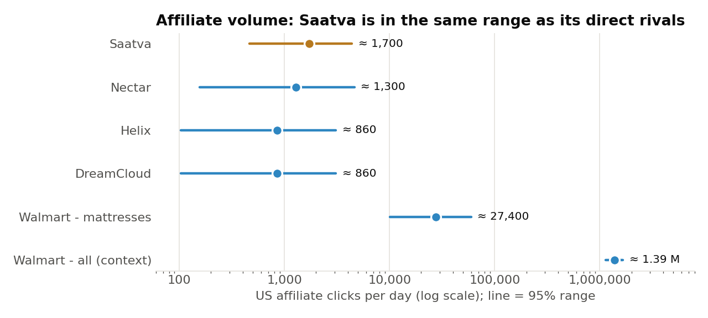
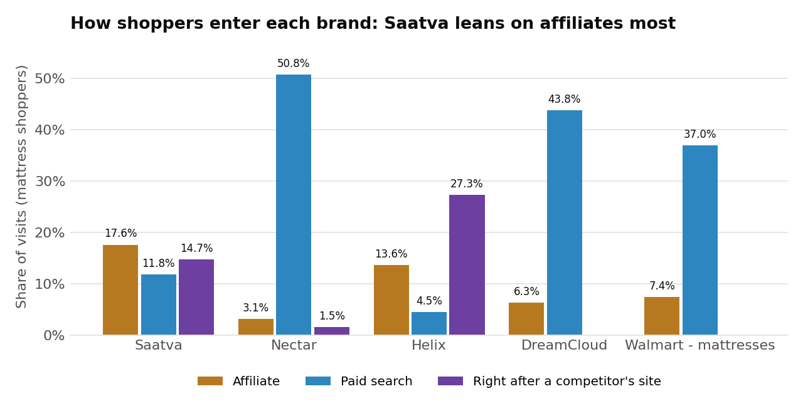
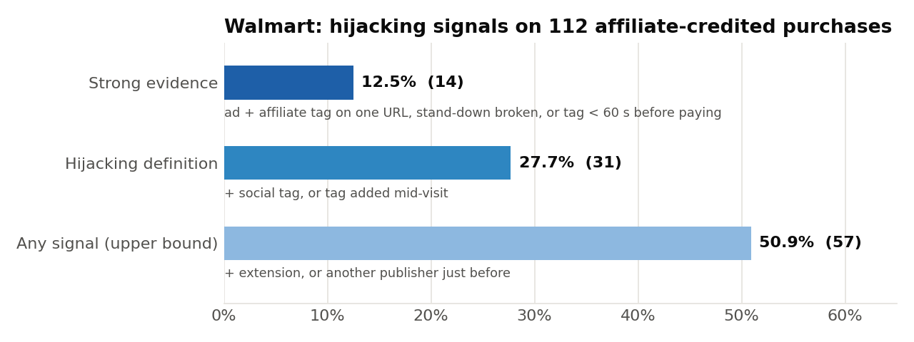
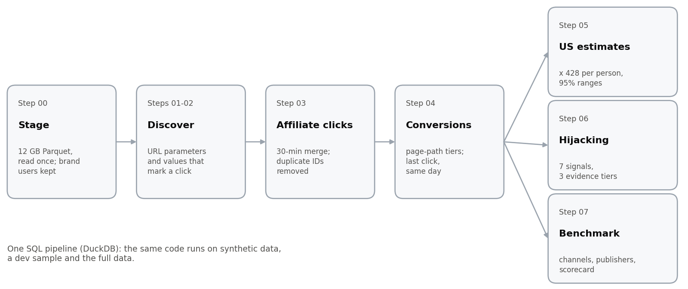

<div dir="rtl">

# תוכנית ה-affiliate של Saatva מול המתחרים (ארה"ב)

> גרסה עברית של מסמכי הפרויקט. הקוד (SQL ו-Python) נמצא ב-repo המקורי: [OriKerem/saatva-affiliate-analysis](https://github.com/OriKerem/saatva-affiliate-analysis).

כיצד תוכנית ה-affiliate של Saatva בארה"ב משתווה ל-Nectar, Helix, DreamCloud ו-Walmart (מחלקת המזרנים),
איפה היא מפגרת מאחור, עד כמה היא חשופה ל-hijacking של שיוך, ומה כדאי לעשות בנדון. הניתוח מבוסס על יום
אחד של נתוני clickstream מ-panel (1 במאי 2026, עם 48.4 M אירועים ו-751,584 אנשים) עם pipeline של DuckDB SQL
שניתן לשחזור.

> **במשפט אחד:** חברת Saatva נשענת על affiliates יותר מכל מתחרה, אבל תלויה במעט publishers
> ואין לה דגל stand-down. קודם כול יש להגן על הערוץ, ואחר כך להרחיב אותו דרך אתרי
> ביקורות ויוצרי תוכן.

---

## 1. קליקים והמרות affiliate לפי מותג

| מותג | קליקי affiliate ב-panel (אנשים) | קליקי affiliate בארה"ב ליום (טווח 95%) | המרות ב-panel שיוחסו לקליק affiliate | שיעור המרה (טווח 95%) |
|---|---:|---:|---:|---:|
| **Saatva** | **4 (4)** | **≈ 1,700** (470 - 4,400) | **0** | 0% (0 - 60%) |
| Nectar | 3 (2) | ≈ 1,300 (160 - 4,600) | 0 | 0% (0 - 84%) |
| Helix | 2 (2) | ≈ 860 (100 - 3,100) | 0 | 0% (0 - 84%) |
| DreamCloud | 2 (2) | ≈ 860 (100 - 3,100) | 0 | 0% (0 - 84%) |
| מחלקת המזרנים של Walmart | 64 (6) | ≈ 27,400 (10,100 - 59,700) | 0 | 0% (0 - 46%) |
| *האתר של Walmart כולו (להקשר)* | *3,234 (1,266)* | *≈ 1.39 M (1.14 - 1.66 M)* | *120 (≈ 51,400 / ליום בארה"ב)* | *3.7% (2.9 - 4.9%)* |

*המרה = רכישה, תשלום, הרשמה או השלמה אחרת; last click, באותו יום. טווחים לארה"ב: שיטת bootstrap
ברמת האדם (Walmart) או רווח Poisson מדויק (≤ 10 אנשים).*  
*שיעור המרה: טווח 95% מדויק של Clopper-Pearson, 0 מתוך n אנשים · טווח 95% של bootstrap ברמת האדם (Walmart כולו).*



- **הנפח דומה, התלות לא.** קליקי ה-affiliate של Saatva נמצאים באותו טווח כמו של המתחרות הישירות
  שלה, אבל ה-affiliates מהווים נתח גדול יותר מהביקורים שלה מאשר אצל כל מתחרה (סעיף 2). הטווחים
  רחבים כי לכל מותג DTC יש 2 עד 4 אנשים מקליקים ב-panel.
- **אי אפשר למדוד המרות של מותגי ה-DTC מיום אחד:** אף אחד מ-132 המבקרים בארבעת אתרי
  ה-DTC לא קנה דבר באותו יום, בשום ערוץ (שיעור רכישה < 2.8%, 95%). 6 מתוך 11 המקליקים על affiliate
  של DTC עברו לאתר מזרנים אחר (5 בתוך 100 s), ואף אחד מ-4 של Saatva: הקליק הוא
  חלק משלב המחקר, ו-Saatva נוטה להגיע בסופו.
- **ההשוואה ל-Walmart נעשית דרך מחלקת המזרנים שלה** (53 מבקרים באותו יום, אותו סדר גודל כמו Nectar).
  האתר כולו, 1.39 M קליקים ביום ברובם על מוצרים אחרים, מוצג להקשר בלבד.

## 2. כיצד התוכנית של Saatva משתווה



| | Saatva | מתחרים |
|---|---|---|
| נתח הביקורים שמגיע מ-affiliates | **17.6%**, הגבוה ביותר | 3.1 - 13.6% |
| מספר ה-publishers הפעילים של affiliate באותו יום | **3** | 2 לכל מתחרה DTC; **20** במחלקת המזרנים של Walmart |
| קליקי affiliate עם דגל ה-stand-down `afsrc=1` | **0%** | אצל Nectar, Helix 100%; במזרנים של Walmart 94%; DreamCloud 50% |
| אתרי ביקורות / תוכן שינה | האתר Sleep Foundation שולח מבקרים, **ללא תשלום** | שותפים בתשלום של mattressclarity, buyersguide, rtings |

המתחרים נשענים על חיפוש ממומן (Nectar 50.8%, DreamCloud 43.8%, Walmart מזרנים 37.0% מהביקורים); Saatva
מקבלת רק 11.8% מחיפוש ממומן, ויותר מ-affiliates מכל אחד אחר.

## 3. חטיפת שיוך (hijacking)

**חטיפת שיוך (hijacking)** = תנועה אורגנית, ישירה, חברתית או ממומנת שמקבלת תג affiliate, כך שה-last click
(והעמלה) הולכים ל-publisher שלא הביא את המבקר. כל נחיתת affiliate נבחנת לפי העמוד שקדם לה
ולפי פרמטרי ה-URL שלה עצמה: 7 סיגנלים ב-3 דרגות ראיה (חזקה, אפשרית, הקשר).

- **אצל Saatva:** אחד מתוך 4 קליקי ה-affiliate שלה נושא גם סמן של מודעת Google וגם
  תג affiliate (`utm_source=brandxemail ... &gad_source=1`). כשאין `afsrc=1` באף קישור, תוספי קופונים לא מקבלים
  סימן לבצע stand-down, ואי אפשר אפילו לזהות הפרה.
- **מה זה עולה בהיקף גדול (Walmart, אותה מכניקת last click):**



- **כל 39 הקליקים של Walmart עם סמן מודעה ותג affiliate מגיעים מ-publisher אחד** (`imp_150372`,
  35 מהם דרך מנוע ההשוואה Bizrate), עם 29 מזהי ad-click שונים של Bing: קליקים אמיתיים על מודעות,
  שתויגו מחדש כ-affiliate. זה ה-publisher של Walmart ב-Impact, לא של Saatva, אבל הוא מראה את המנגנון
  בהיקף גדול, ושכל התופעה יכולה לנבוע מ-publisher אחד: ניתן לזהות ולתקן.

## 4. המלצות

| | פעולה | ראיה |
|---|---|---|
| **הגנה** | הוספת `afsrc=1` לכל קישור Partnerize; סעיף stand-down בתנאי השותפים | 0% מהקליקים של Saatva לעומת 50 - 100% אצל המתחרים |
| | ביטול עמלה על נחיתות עם `gclid` / `gad_source` / `msclkid` | 1 מתוך 4 קליקים של Saatva; 39 קליקים של Walmart מ-publisher אחד |
| | ללא עמלה מלאה על תג שהוצב < 60 s לפני ההזמנה | 10 מתוך 112 רכישות ב-Walmart |
| **צמיחה** | גיוס אתרי ביקורות ושינה (Sleep Foundation, mattressclarity, buyersguide, rtings) | המתחרים משלמים לאתרים האלה; Sleep Foundation כבר שולח מבקרים ל-Saatva |
| | הוספת יוצרי תוכן ותוכן השוואתי | מחלקת המזרנים של Walmart מפעילה 20 publishers |
| **מדידה** | 30+ ימים של נתוני Partnerize | יום אחד לא יכול להראות רכישת מזרן |
| | ניסוי holdout למדידת incrementality | ב-Walmart, מבקרי affiliate קונים יותר (9.6% לעומת 6.5%), אבל זה מתאם |
| | כרטיס ציון חודשי ל-publishers | קליקים לאדם, הפרות stand-down, קליקים ב-checkout |

## 5. שיטה



- **גילוי מתוך הנתונים, לא מהזיכרון:** סמני ה-affiliate של כל רשת (ב-Partnerize `click_id`,
  ב-Impact `irgwc` / `irclickid`, ב-Walmart `veh=aff` / `wmlspartner=imp_...`) אותרו ב-URL של הנחיתה
  ואומתו לפי הערכים שלהם; כמעט כל קליק מזוהה על ידי שני סמנים בלתי תלויים.
- **ספירה לפי אדם:** ה-panel רושם 4.1% מהאנשים תחת כמה מזהים (Saatva: 7 קליקים, 4 אנשים).
- **פלט אחד לכל המספרים:** הקובץ `brand_scorecard.csv` (שלב 07) מכיל כל מספר מרכזי לכל מותג;
  כל טבלת ביניים מתועדת במסמך של השלב שלה.
- **הרחבה לארה"ב:** מקדם ההרחבה הוא 322 M משתמשי אינטרנט בארה"ב (DataReportal 2025) / 751,584 אנשים ב-panel = 428.4. טווחים:
  שיטת bootstrap ברמת האדם עבור Walmart; רווחים מדויקים לספירות קטנות (Garwood לקליקים,
  ו-Clopper-Pearson ל-0 מתוך n אנשים).

## 6. הנחות ומגבלות

- יום אחד של נתונים (יום שישי, 1 במאי 2026): אין חלון שיוך רב-יומי, אין דפוס שבועי.
- ה-panel מייצג משתמשי אינטרנט בארה"ב. אין לו משקולות, וככל הנראה הוא משקף גלישה בדסקטופ
  יותר מאפליקציות מובייל. המספרים המוחלטים לארה"ב הם סדר גודל; ההשוואות בין המותגים מושפעות הרבה פחות.
- קרדיט לפי last click, באותו יום. ההשוואה ל-Walmart נעשית דרך מחלקת המזרנים שלה.
- סיגנל hijacking הוא סיבה לבדיקה, לא הוכחה.

## 7. תיקוף

1. **נתונים סינתטיים עם מקרים שנשתלו:** כל המקרים זוהו.
2. **מדגם אקראי של 5% מהמשתמשים:** אותם סיגנלי affiliate ב-~5% מהמשתמשים בנתונים המלאים (4.3 - 4.9%).
3. **מדגם dev** (כל קונה DTC ומזרנים ב-Walmart + 5% אקראיים + המזהים הכפולים שלהם): 13 פלטים של DTC
   ומזרנים, 0 הבדלים מההרצה המלאה.
4. **נתונים מלאים ב-SQL (DuckDB):** נפח של 12 GB עבר staging פעם אחת; פלטים זהים בכל הרצה חוזרת.

## 8. עם יותר זמן

- 30 ימים של נתונים וההמרות של Partnerize עצמה: חלונות של 7 ו-30 ימים, ושיעור המרה מדוד ל-Saatva.
- ניסוי holdout לפי publisher או לפי אזור: האם ה-affiliates מוסיפים מכירות, או רק אוספים קרדיט?
- ביקורת על ה-publishers של Saatva עצמה לאיתור אותו דפוס (קליקים על מודעות ממומנות שתויגו מחדש כ-affiliate), החל
  מ-`brandxemail`, באמצעות נתוני הקליקים המלאים של Partnerize.
- שקלול ה-panel לאוכלוסיית ארה"ב, סינון בוטים, התאמה של מזהים כפולים חלקיים.
- הקמת pipeline יומי עם בדיקות נתונים, התראות סיכון ל-publishers ודשבורד מתחרים.

---

## מפת המאגר

| נתיב | תוכן |
|---|---|
| `docs/00_external_inputs.md` | רקע ציבורי: רשתות affiliate לכל מותג, קלט להרחבה |
| `docs/01_problem_breakdown.md` | שאלות, הגדרות מדדים, מתודולוגיה, הנחות |
| `docs/02_data_profiling.md` | בדיקות איכות נתונים וההחלטות הנגזרות מהן |
| `docs/03_affiliate_discovery.md` | איך תנועת affiliate נראית בנתונים, לכל מותג; ערכי פרמטרים |
| `docs/04_pipeline_efficiency.md` | תהליך ה-staging, מדגמים (`--subset`, `--dev`), שחזוריות, זמני ריצה |
| `docs/05_affiliate_clicks.md` | מילון קליקי affiliate, איחוד של 30 דקות, כפילויות ב-panel (`person_map`) |
| `docs/06_conversions.md` | דרגות המרה, שיוך last click, בדיקת האפס של DTC |
| `docs/07_us_scaling.md` | אומדנים לארה"ב, bootstrap ברמת האדם, רווחים מדויקים לספירות קטנות; סגמנט המזרנים של Walmart |
| `docs/08_hijacking.md` | מסלולי כניסה, סיגנלים S1-S7, דרגות ראיה, עמלה בסיכון, כרטיס ציון ל-publishers, המלצות |
| `docs/09_competitive_benchmark.md` | תמהיל ערוצים, publishers, cross-shopping, כרטיס ציון למותגים, המלצות צמיחה |
| `sql/` | ה-pipeline של DuckDB SQL, ממוספר לפי סדר ההרצה (`00_stage` ... `07_competitive_benchmark`) |
| `src/run_pipeline.py` | מריץ את בלוקי ה-SQL לפי הסדר; מצבי הרצה ומגבלות משאבים |
| `src/make_synthetic_data.py` | קובץ fixture סינתטי לבדיקות עם מקרים שנשתלו |
| `src/make_charts.py` | בונה את הגרפים ב-`docs/img/` מתוך הפלטים של ההרצה המלאה |
| `data/`, `outputs/` | לא נכללים ב-commit. יש למקם את קובצי ה-Parquet ב-`data/raw/`; התוצאות נכתבות ל-`outputs/` |

## איך מריצים

```bash
pip install duckdb pandas pyarrow matplotlib
# put the Parquet files in data/raw/
python src/run_pipeline.py --steps 00 01 02 03 04 05 06 07   # full data (05 also runs 05b)
python src/make_charts.py                                    # README charts from the full-run outputs
python src/run_pipeline.py --subset                          # random 5% of users (rates, distributions)
python src/run_pipeline.py --dev                             # logic-validation sample (doc 04 §5.1); not for rates
python src/make_synthetic_data.py && python src/run_pipeline.py --data data/synthetic   # test fixture
```

כל קובץ SQL מחולק לבלוקים של `-- name:`: בלוקי `build_*` יוצרים טבלאות ביניים, והשאר
כותבים `outputs/<step><suffix>/<block>.csv`. כל מצב הרצה שומר פלטים וקובץ DuckDB משלו.

</div>
